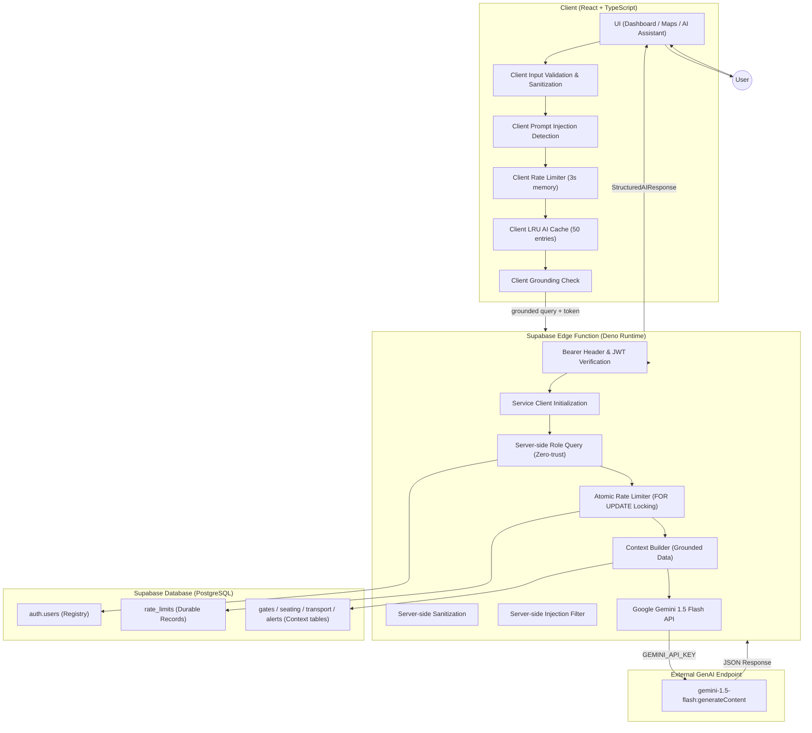
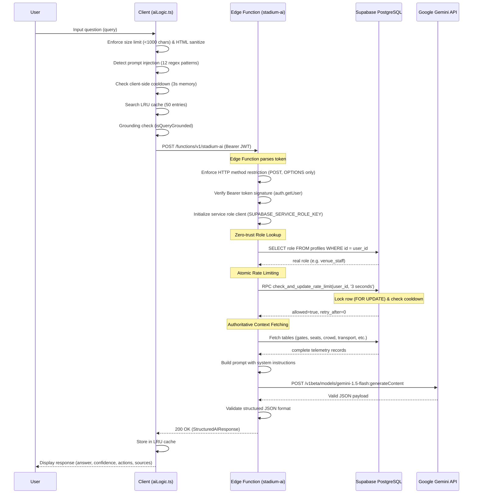

# System Architecture

StadiumIQ is a server-split decision-support platform designed to handle smart stadium telemetry during the FIFA World Cup 2026. The solution leverages React on the frontend and Supabase (PostgreSQL, Auth, Edge Functions) with Google Gemini AI on the backend.

---

## 🗺️ System Topology

---

## 🔄 Client-to-Edge Request Sequence

The sequence diagram below shows the end-to-end request path of an assistant query. It highlights zero-trust authorization (bypassing client-supplied roles) and database row locking during rate checks.

---

## 🔑 Authentication & Authorization (Zero-Trust)

### Authenticated Token Extraction
Client requests must include the user's Supabase session JWT in the `Authorization` header under the `Bearer <token>` scheme. The Edge Function verifies this token cryptographically on Supabase Auth. Any missing, malformed, or invalid tokens are rejected with `401 Unauthorized`.

### Server-Side Role Enforcement
The application implements a zero-trust model for user roles. The client-supplied role parameter in the request body is **completely ignored** for authorization. The Edge Function uses the `SUPABASE_SERVICE_ROLE_KEY` to query the authenticated user's real role from the database `profiles` table. This role (e.g., `fan`, `volunteer`, `venue_staff`, `organizer`) is then used to construct the system prompt.

---

## 🚦 Server-Side Atomic Rate Limiting

Rate limiting is verified at the database level using a PostgreSQL-stored function `check_and_update_rate_limit`. 
1. **Row Locking**: When a request arrives, the function locks the user's rate record (`SELECT ... FOR UPDATE`), preventing concurrent requests from bypassing the check.
2. **Atomic Comparison**: The difference between the current time and the locked `last_request_at` timestamp is evaluated. If it is less than the 3-second cooldown interval, the request is rejected.
3. **Transaction Commit**: If allowed, the timestamp is updated to the current time, and the row lock is released upon transaction commit.
4. **Fallback Strategy**: In environments where the RPC function is not present, the Edge Function falls back gracefully to a standard select-then-upsert query to maintain service continuity.

---

## 🌐 CORS & HTTP Restriction

- **Allowed Methods**: Restricted strictly to `POST` and `OPTIONS` (preflight). All other HTTP verbs are rejected with `450 Method Not Allowed` or `405 Method Not Allowed` headers.
- **Trusted Origins**: The `Access-Control-Allow-Origin` header is mapped to the configured origins stored in the server-side `ALLOWED_ORIGINS` environment variables. 
- **Developer Support**: Dynamic local development support is maintained by verifying that the origin headers match the regex `^https?://localhost(:\d+)?$`. If the origin is untrusted, a safe fallback origin is returned.
