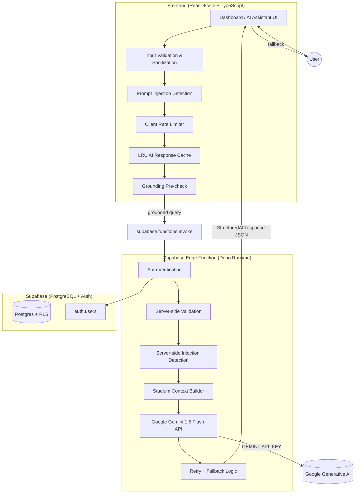
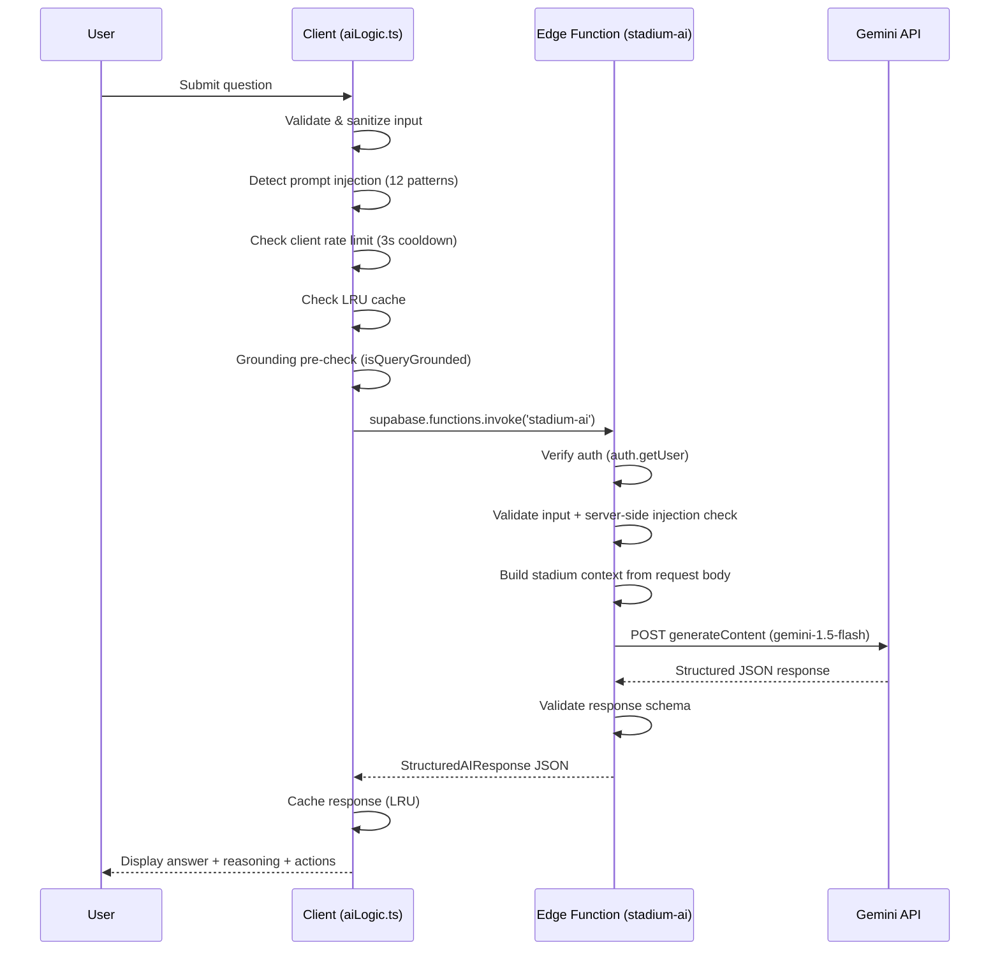

# StadiumIQ Architecture

## Overview

StadiumIQ is a Generative AI decision-support platform for FIFA World Cup 2026 stadium operations. It serves fans, volunteers, venue staff, and organizers with real-time navigation, crowd intelligence, transport coordination, sustainability tracking, and an AI assistant powered by Google Gemini 1.5 Flash.

## System Architecture



## AI Assistant Request Flow



## Structured AI Response Schema

All AI responses conform to a single schema, validated on both server and client:

```typescript
interface StructuredAIResponse {
  answer: string;              // User-facing answer
  confidence: number;          // 0..1
  reasoningSummary: string;    // Brief, grounded reasoning
  recommendedActions: string[];// Actionable next steps
  sources: string[];           // Data sources used (gates, crowd_density, etc.)
  language: LanguageCode;       // Response language (en, es, fr, de, pt, ar, zh)
  isFallback: boolean;          // True if no grounded answer available
}
```

## Security Architecture

| Layer | Control |
|-------|---------|
| Client | Input validation, HTML entity encoding, 12-pattern injection detection, 3s rate limit, LRU cache, grounding pre-check |
| Edge Function | Auth verification (`auth.getUser`), input validation, server-side injection detection, structured response validation, retry with backoff, fallback on any error |
| Secrets | `GEMINI_API_KEY` lives ONLY in Supabase secrets — never in frontend code, env files, or build output |
| Database | Row Level Security on all tables, `auth.uid()` ownership checks, `TO authenticated` policies |

## Role-Aware Responses

The edge function adjusts the system prompt based on user role:

- **Fan**: navigation, seats, gates, restrooms, medical, accessibility
- **Volunteer**: assigned tasks, crowd support, incident handling
- **Venue Staff**: facility status, operational alerts, incident response
- **Organizer**: crowd redirection, volunteer deployment, congestion response, transport planning

## Multilingual Support

Seven languages are supported: English, Spanish, French, German, Portuguese, Arabic, Chinese. The language code is passed to Gemini, which generates native-language responses (not translation tags). Fallback responses are also localized.

## Code Splitting & Performance

- React lazy loading with Suspense for all route-level components
- Manual Vite chunks: vendor, supabase, motion, icons
- LRU cache (50 entries) prevents redundant Gemini calls
- Client-side grounding check avoids network calls for ungrounded queries
- Client-side rate limiting prevents abuse before hitting the server

## Testing Strategy

- **Vitest + React Testing Library**: 118+ tests across 13 test files
- **Unit tests**: validation, sanitization, cache, rate limiter, stadium data, AI logic
- **Component tests**: loading states, theme context, protected routes, auth pages, landing page
- **Edge function tests**: auth, injection, grounding, role-aware, multilingual, secret exposure prevention
- **Accessibility tests**: skip link, landmarks, ARIA labels, heading hierarchy
- CI runs typecheck, lint, tests, and build on every push
